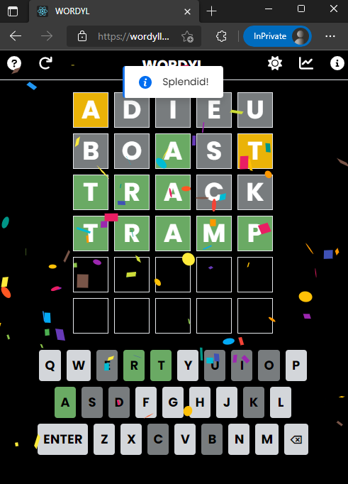

# WORDYL

WORDYL is a simple Wordle clone, built with [React](https://reactjs.org/) and [Tailwind CSS](https://tailwindcss.com/).

## Links

 Watch it in action [here](https://wordyll.netlify.app/)

 ## Features
- 5 letter word, six guesses
- Uses the same word list as the original wordle
- Can play any number of times in a day
- Guess distribution statistics
- App theme based on device theme (can be changed manually too!)
- Responsive design

## Snapshots

## Built With

- React
- Tailwind CSS
- Chart JS (for guess distribution stats)

## Run locally

- Clone this repo
- Run `npm install` and `npm start`
- The application opens in `http://localhost:3000/` or any other available port

## To-do
- Dynamically change number of letters/ guesses
- Share the guesses made (as in original Wordle)
- Use keyboard for typing (in PCs)
- Add animations

## Credits

- [Compare Words](https://www.npmjs.com/package/compare-words)

##

Contributions, issues and feature requests are always welcome!
Star the repo if you like this project :)
This repository is open sourced for learning purposes only.